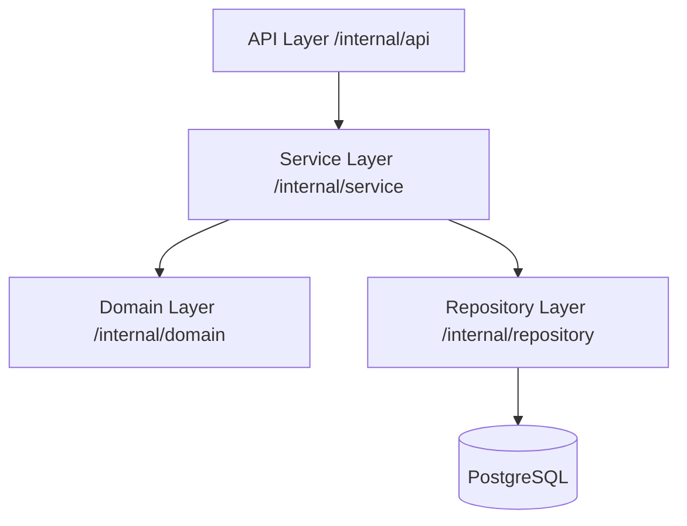

# Transaction Routine API

A High-performance Go microservice for managing customer accounts and financial transactions, built with Clean Architecture and production-grade observability.

##  Architecture

The project follows **Clean Architecture** principles to ensure separation of concerns and maintainability.



### Layer Responsibilities
- **Domain**: Pure business logic and entities. No dependencies on other layers.
- **Service**: Orchestrates business rules. Defines interfaces for repositories.
- **Repository**: Handles data persistence and database-specific logic.
- **API**: HTTP handlers, routing, and request/response transformation.

---

##  Core Features

- **Account Management**: Seamlessly create and retrieve customer profiles.
- **Transaction Processing**: Automatic normalization of transaction amounts based on operation types:
    - `1 (Normal Purchase)`: Negative
    - `2 (Purchase with Installments)`: Negative
    - `3 (Withdrawal)`: Negative
    - `4 (Credit Voucher)`: Positive
- **Observability**: Structured JSON logging using `uber-go/zap` for easy log aggregation.
- **Resilience**: Graceful shutdown and healthchecks for reliable service availability.
- **Testing Excellence**: Integrated testing with `testcontainers` for real DB validation.

---

##  Configuration

The application can be configured using environment variables.

| Variable      | Description                    | Default            |
| ------------- | ------------------------------ | ------------------ |
| `APP_PORT`    | Port the API server listens on | `8080`             |
| `DB_HOST`     | Database host                  | `localhost` / `db` |
| `DB_PORT`     | Database port                  | `5432`             |
| `DB_USER`     | Database username              | `postgres`         |
| `DB_PASSWORD` | Database password              | `postgres`         |
| `DB_NAME`     | Database name                  | `transaction_db`   |

---

##  Getting Started

### Prerequisites
- Go 1.24+
- Docker & Docker Compose (for infrastructure and tests)

### Quick Start (Docker)
```bash
make docker-up
```
The API becomes available at `http://localhost:8080`.

### Manual Development
1. Start the DB: `docker-compose up db`
2. Run the API: `make run`

---

##  API Specification

### Accounts

#### Create Account
`POST /accounts`
- **Request Body**:
  ```json
  { "document_number": "12345678900" }
  ```
- **Responses**:
    - `201 Created`: Returns the created account object.
    - `400 Bad Request`: Invalid document number or missing body.

#### Get Account
`GET /accounts/:accountId`
- **Responses**:
    - `200 OK`: Returns the account object.
    - `404 Not Found`: Account does not exist.

### Transactions

#### Register Transaction
`POST /transactions`
- **Request Body**:
  ```json
  {
    "account_id": 1,
    "operation_type_id": 4,
    "amount": 150.00
  }
  ```
- **Responses**:
    - `201 Created`: Transaction processed successfully.
    - `400 Bad Request`: Invalid business logic (e.g., unknown operation type).
    - `404 Not Found`: Account not found.

---

##  Testing & Performance

### Running Tests
We use standard Go testing patterns along with Testcontainers for integration tests.
```bash
# Run all tests
make test

# With coverage report
go test ./... -coverprofile=coverage.out
go tool cover -html=coverage.out
```


---

##  Project Structure

- `cmd/api`: Application entry point and DI wiring.
- `internal/api`: HTTP handler implementations.
- `internal/service`: Business logic core.
- `internal/repository`: PostgreSQL persistence.
- `internal/domain`: Domain entities and core rules.
- `pkg/errors`: Custom error types and wrapping utilities.
- `scripts`: Database initialization SQL.
